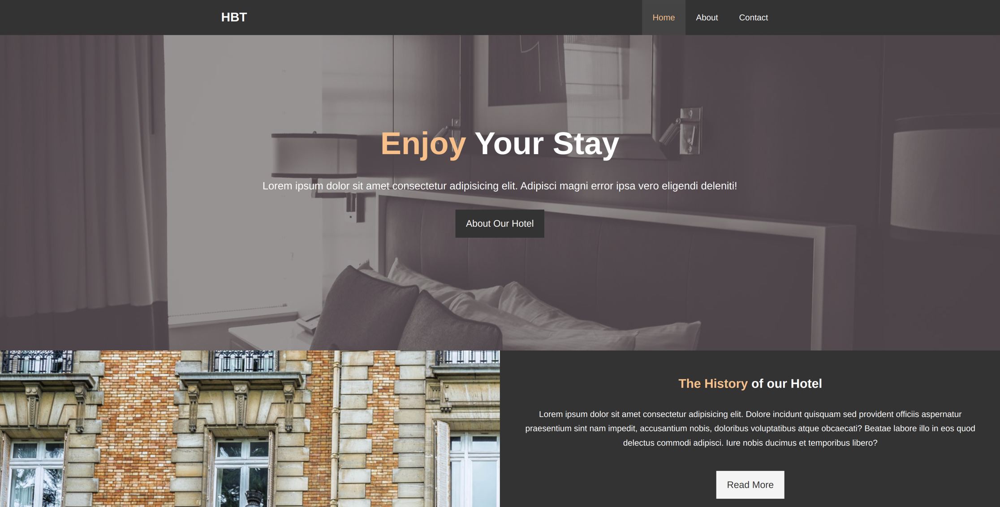

# Welcome to #HBT


# Steps to clone this project

1. Clone Repository
    ```sh
    git clone https://lab.skynetinc.tech/WorldDrknss/Hotel-Website.git
    ```

2. `cd` into the cloned repository
    ```sh
    cd Hotel-Website
    ``` 

3. Launch in Visual Studio Code (if installed)
    ```sh
    code .
    ```

# Technologies 🔥

This project is built using HTML, CSS, and FontAwesome.
  
# Objective‼

To create a base starting point for entry level HTML and CSS developers that extend beyond just your basic HTML tags.
# Features ✨
Complet basic web site, that can be extended or used as is.<br>
Additional pages included:
- about.html
- contact.html